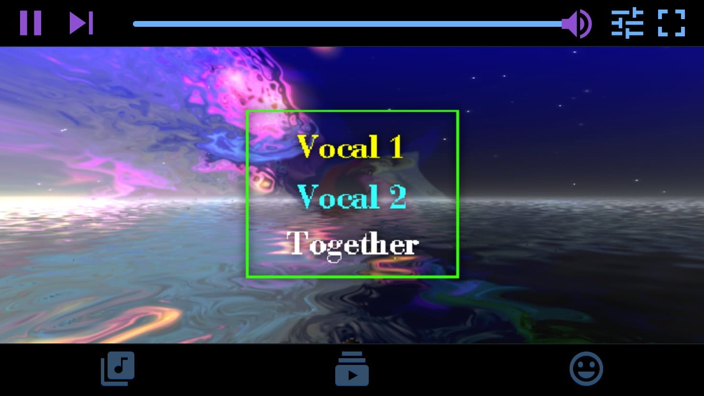

<!--
N.B.: This README was automatically generated by https://github.com/YunoHost/apps/tree/master/tools/README-generator
It shall NOT be edited by hand.
-->

# Karaoke Eternal for YunoHost

[](https://dash.yunohost.org/appci/app/karaokeforever_ynh)    
[](https://install-app.yunohost.org/?app=karaokeforever_ynh)

*[Lire ce readme en français.](./README_fr.md)*

> *This package allows you to install Karaoke Eternal quickly and simply on a YunoHost server.
If you don't have YunoHost, please consult [the guide](https://yunohost.org/#/install) to learn how to install it.*

## Overview

Host awesome karaoke parties where everyone can easily find and queue songs from their phone’s browser. The player is also fully browser-based with support for MP3+G, MP4 videos and WebGL visualizations. The server is self-hosted and runs on nearly everything.
### Features


- Supports:
   - MP3+G with Winamp/MilkDrop visualizations (WebGL 2)
   - MP4 videos
   - ReplayGain tags for volume normalization
- Fast, modern mobile browser app designed for “karaoke conditions”
- Multiple simultaneous rooms/queues (optionally password-protected)
- Dynamic queues keep parties fair, fun and no-fuss
- Fully self-hosted
- No ads or telemetry


**Shipped version:** 1.0~ynh1


## Screenshots



## Documentation and resources

* Official app website: <https://www.karaoke-eternal.com>
* Official user documentation: <https://www.karaoke-eternal.com/>
* Official admin documentation: <https://www.karaoke-eternal.com/docs/>
* Upstream app code repository: <https://github.com/bhj/KaraokeEternal/>
* YunoHost documentation for this app: <https://yunohost.org/app_karaokeforever_ynh>
* Report a bug: <https://github.com/YunoHost-Apps/karaokeforever_ynh_ynh/issues>

## Developer info

Please send your pull request to the [testing branch](https://github.com/YunoHost-Apps/karaokeforever_ynh_ynh/tree/testing).

To try the testing branch, please proceed like that.

``` bash
sudo yunohost app install https://github.com/YunoHost-Apps/karaokeforever_ynh_ynh/tree/testing --debug
or
sudo yunohost app upgrade karaokeforever_ynh -u https://github.com/YunoHost-Apps/karaokeforever_ynh_ynh/tree/testing --debug
```

**More info regarding app packaging:** <https://yunohost.org/packaging_apps>
