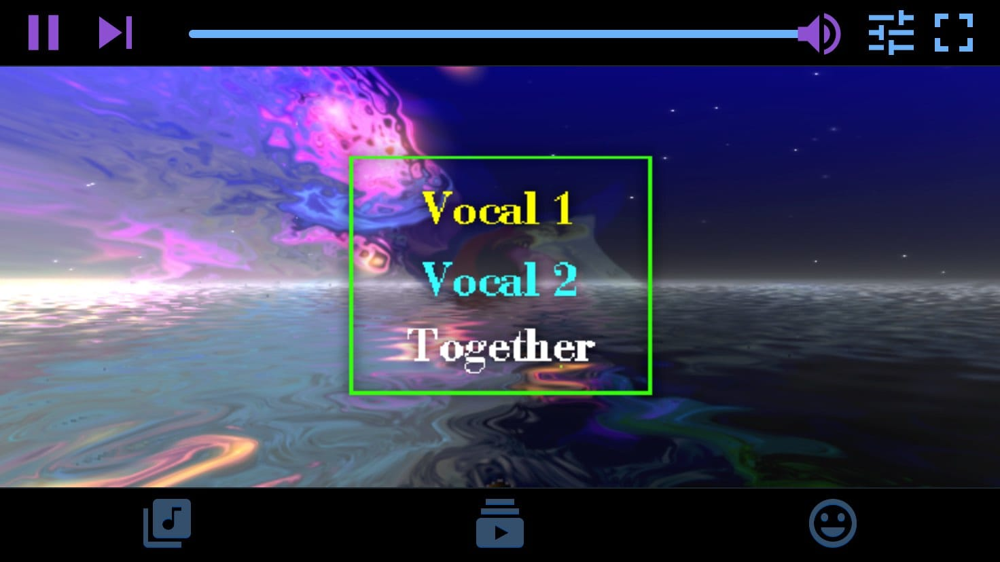

<!--
N.B.: This README was automatically generated by https://github.com/YunoHost/apps/tree/master/tools/README-generator
It shall NOT be edited by hand.
-->

# Karaoke Eternal pour YunoHost

[](https://dash.yunohost.org/appci/app/karaokeforever_ynh)    
[](https://install-app.yunohost.org/?app=karaokeforever_ynh)

*[Read this readme in english.](./README.md)*

> *Ce package vous permet d'installer Karaoke Eternal rapidement et simplement sur un serveur YunoHost.
Si vous n'avez pas YunoHost, regardez [ici](https://yunohost.org/#/install) pour savoir comment l'installer et en profiter.*

## Vue d'ensemble

ost awesome karaoke parties where everyone can easily find and queue songs from their phone’s browser. The player is also fully browser-based with support for MP3+G, MP4 videos and WebGL visualizations. The server is self-hosted and runs on nearly everything.
### Features


- Supports:
   - MP3+G with Winamp/MilkDrop visualizations (WebGL 2)
   - MP4 videos
   - ReplayGain tags for volume normalization
- Fast, modern mobile browser app designed for “karaoke conditions”
- Multiple simultaneous rooms/queues (optionally password-protected)
- Dynamic queues keep parties fair, fun and no-fuss
- Fully self-hosted
- No ads or telemetry


**Version incluse :** 1.0~ynh1


## Captures d'écran



## Documentations et ressources

* Site officiel de l'app : <https://www.karaoke-eternal.com>
* Documentation officielle utilisateur : <https://www.karaoke-eternal.com/>
* Documentation officielle de l'admin : <https://www.karaoke-eternal.com/docs/>
* Dépôt de code officiel de l'app : <https://github.com/bhj/KaraokeEternal/>
* Documentation YunoHost pour cette app : <https://yunohost.org/app_karaokeforever_ynh>
* Signaler un bug : <https://github.com/YunoHost-Apps/karaokeforever_ynh_ynh/issues>

## Informations pour les développeurs

Merci de faire vos pull request sur la [branche testing](https://github.com/YunoHost-Apps/karaokeforever_ynh_ynh/tree/testing).

Pour essayer la branche testing, procédez comme suit.

``` bash
sudo yunohost app install https://github.com/YunoHost-Apps/karaokeforever_ynh_ynh/tree/testing --debug
ou
sudo yunohost app upgrade karaokeforever_ynh -u https://github.com/YunoHost-Apps/karaokeforever_ynh_ynh/tree/testing --debug
```

**Plus d'infos sur le packaging d'applications :** <https://yunohost.org/packaging_apps>
